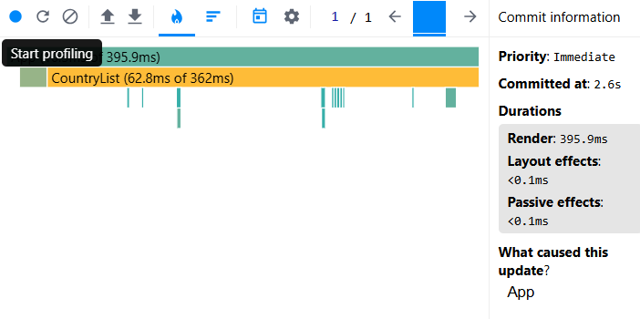
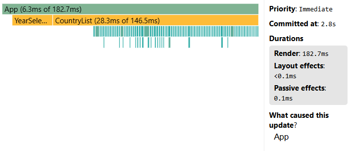
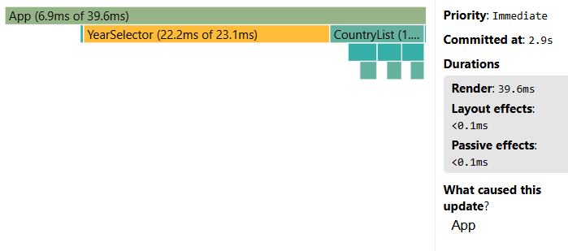
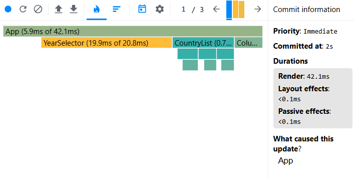

# Performance Optimization Report

## Baseline Measurements

### Interaction A: Sort countries

- **Commit duration**: 2.6 s
- **Render duration**: 395.9 ms
- **Screenshot**: 

### Interaction B: Search countries

- **Commit duration**: 2.8 s
- **Render duration**: 182.7 ms
- **Screenshot**: 

### Interaction C: Change year

- **Commit duration**: 2.9 s
- **Render duration**: 39.6 ms
- **Screenshot**: 

### Interaction D: Toggle column

- **Commit duration**: 2 s
- **Render duration**: 42.1 ms
- **Screenshot**: 
